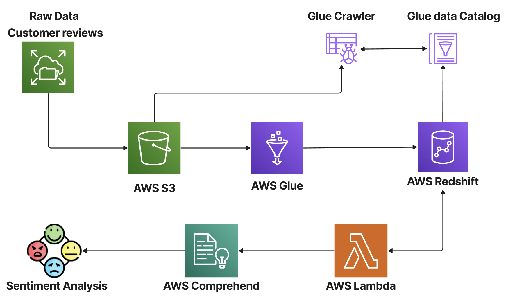

# ETL-pipeline-creation-with-Glue

This project repository is created in partial fulfillment of the requirements for the Big Data Analytics course offered by the Master of Science in Business Analytics program at the Carlson School of Management, University of Minnesota.

# Introduction to ETL and AWS Glue

Automation is a key component in synthesizing end-to-end machine learning products. Data preparation is the first and the most vital step in analytics to obtain quality results. Data Analytics and Machine Learning work-streams rely on ETL for their basis. ETL cleanses and organizes data using a set of business rules to meet particular business intelligence requirements while enhancing back-end operations and end-user experience. 
 
AWS Glue is a serverless data integration service that makes it easier to discover, prepare, move, and integrate data from multiple sources for analytics, machine learning, and application development. Users can discover and connect to over 70 diverse data sources, manage data in a centralized data catalog, and visually create, run, and monitor ETL pipelines to load data into data lakes. In this project, we utilize Amazon's customer reviews data in tandem with AWS Redshift to demonstrate the use of AWS Glue.
 
## Dataset Description

Amazon Customer Reviews (a.k.a. Product Reviews) is one of Amazon’s iconic products. In a period of over two decades since the first review in 1995, millions of Amazon customers have contributed over a hundred million reviews to express opinions and describe their experiences regarding products on the Amazon.com website. 

The dataset contains the customer review text with accompanying metadata, consisting of two major components:

1. A collection of reviews written in the Amazon.com marketplace and associated metadata from 1995 until 2015. This is intended to facilitate study into the properties (and the evolution) of customer reviews potentially including how people evaluate and express their experiences with respect to products at scale. (130M+ customer reviews)
2. A collection of reviews about products in multiple languages from different Amazon marketplaces, intended to facilitate analysis of customers’ perception of the same products and wider consumer preferences across languages and countries. (200K+ customer reviews in 5 countries)

The dataset is currently available in two file formats.

1. Tab separated value (TSV), a text format - s3://amazon-reviews-pds/tsv/
2. Parquet, an optimized columnar binary format - s3://amazon-reviews-pds/parquet/

In this implementation, we a small sample of the parquet dataset to orchestrate the pipeline.

Link: https://s3.console.aws.amazon.com/s3/buckets/amazon-reviews-pds?region=us-east-1&tab=objects

## Approach

1. Store a sample dataset of customer reviews in Amazon Simple Storage Service (Amazon S3).
2. Use an AWS Glue crawler to create an AWS data catalog.
3. Use a Glue job to load data in Redshift
4. Use AWS Lambda functions and Amazon Comprehend to analyze the sentiment and entities in the reviews.

To replicate, follow the steps in order mentioned in .md filenames.

## Tools and technologies used

1. Amazon S3
2. AWS Glue
3. Amazon Redshift
4. AWS VPC
5. AWS Lambda
6. Amazon Comprehend

**AWS Architecture**

**Flyer, PPT and Project Video Link**

[Flyer Link](Images/Flyer.pdf)

[PPT Link](https://docs.google.com/presentation/d/1iY0Q9V4hJqRbCnPJgCE8HwLcDXeXjKx8/edit?usp=sharing&ouid=112117916252631522217&rtpof=true&sd=true)

[Video Link](https://drive.google.com/drive/folders/15BsFyoAuZS77zKKbfkOz3hyFjv7asbkg?usp=share_link)
