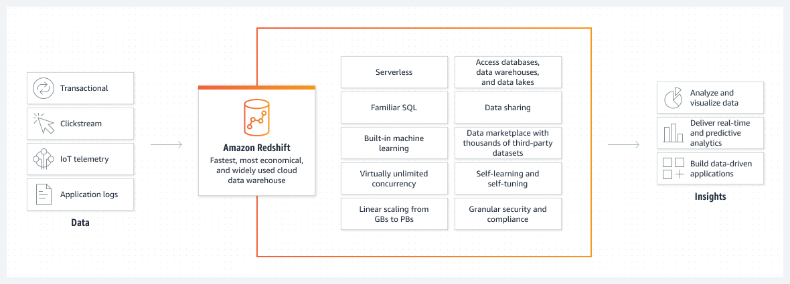

## Amazon Redshift Overview

Amazon Redshift is a fast, fully managed, petabyte-scale data warehouse service that makes it simple and cost-effective to efficiently analyze data using existing business intelligence tools. It is optimized for datasets ranging from a few hundred gigabytes to a petabyte or more and costs less than $1,000 per terabyte per year, a tenth the cost of most traditional data warehousing solutions.

Redshift uses SQL to analyze structured and semi-structured data across data warehouses, operational databases, and data lakes, using AWS-designed hardware and machine learning to deliver the best price performance at any scale. It delivers incredibly fast performance using two key architectural elements: columnar data storage and massively parallel processing design.

## Advantages Over Traditional Data Warehouses

* Columnar Data Storage:
Traditional relational databases use row-based storage. This is ideal for use cases that involve querying and updating specific rows, such as in CRM and ERP applications. However, since indexes take up bandwidth and resources on their own and many contribute to slowing down database performance, database architects need to carefully evaluate which columns may be queried more often and create indexes accordingly. However, Redshift groups similar data types, allowing for better compression. Since less memory is utilized for loading compressed data, there is free memory available for analysis, improving query performance.

* Massively Parallel Processing (MPP):
MPP is a distributed design approach, developed by ParAccel, that enables faster processing of larger datasets. Here, the dataset is split into many parts and processed in parallel to return results quicker. Redshift uses the MPP design in its clusters. Although technically, you can deploy a single-node instance, the advantage of Redshift lies in multi-node cluster that can parallel process data.

* Concurrency scaling:
AWS Redshift recently launched concurrency scaling, a new feature built to tackle the challenge of uneven cluster use. Many organizations have use cases where data analysts run heavy workloads during a certain time window, but at other times the clusters remain unutilized.

* Integration with machine learning:
By using Redshift, users can leverage the entire AWS cloud ecosystem. One example of this is Redshift’s capability to integrate with the AWS Machine Learning (ML) service. Although Redshift enables users to perform ETL operations at an incredible speed, data scientists still need to write their own algorithms to perform analysis.

* Compiled code:
Redshift utilizes an interesting strategy to expedite query running time. After compiling the query once, the platform distributes this compiled code across the cluster. When the leader node distributes data across compute nodes, it also sends the compiled code, removing any additional processing overhead.
    
## Implementation steps

1. Sign into AWS account using admin user credentials and go to [Redshift](https://us-east-1.console.aws.amazon.com/redshiftv2/home?region=us-east-1#landing).
2. Click on Create cluster.
3. Give this cluster a name. We used the default one in our implementation 'redshift-cluster-1'.
4. Under Database Configurations, give a username and password.
5. Under Associated IAM Roles, click on Manage IAM Roles and then click on Create IAM role. Select Any S3 bucket in the pop up and click on Create IAM role as default.
6. Click Create cluster.
7. Now run the SQL queries in [this file](Redshift_Queries.sql) in Query Editor for creating the database, schema and required table. Make sure to change database after creating the same to create schema and table in the newly craeted database, and not the default dev database of Redshift.

*Sources:*  
https://www.talend.com/resources/amazon-redshift/  
https://aws.amazon.com/redshift/
